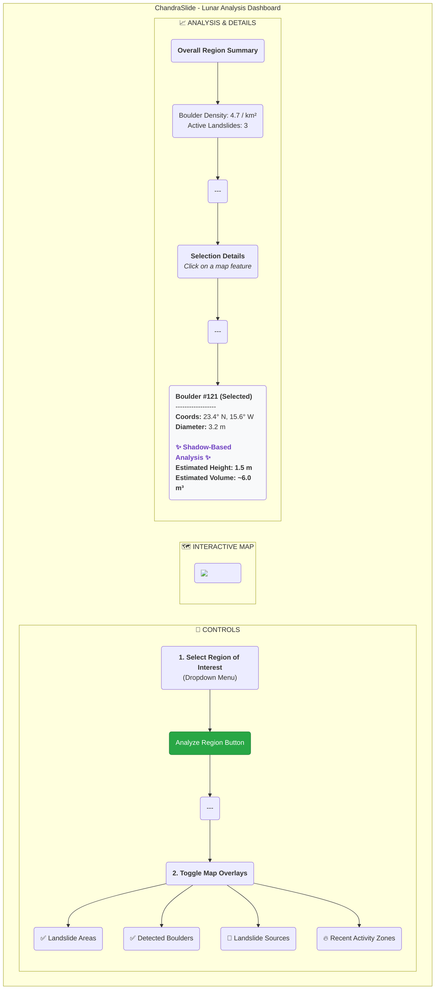

```mermaid
graph TD
    subgraph "ChandraSlide - Lunar Analysis Dashboard"
        direction LR

        %% CONTROLS PANEL (LEFT) %%
        subgraph "🔬 CONTROLS"
            direction TB
            A1("<b>1. Select Region of Interest</b><br/>(Dropdown Menu)") --> A2(Analyze Region Button)
            style A2 fill:#28a745,color:white,stroke:#1e7e34
            A2 --> A3("---")
            A3 --> A4("<b>2. Toggle Map Overlays</b>")
            A4 --> A5("✅ Landslide Areas")
            A4 --> A6("✅ Detected Boulders")
            A4 --> A7("📍 Landslide Sources")
            A4 --> A8("🔥 Recent Activity Zones")
        end

        %% MAP PANEL (CENTER) %%
        subgraph "🗺️ INTERACTIVE MAP"
            B1("<img src='https://miro.medium.com/v2/resize:fit:4354/format:webp/1*7hgwrEPxY1KFwzNO3TnIFA.png?text=Interactive+Lunar+Map' />")
        end

        %% INFO PANEL (RIGHT) %%
        subgraph "📈 ANALYSIS & DETAILS"
            direction TB
            C1("<b>Overall Region Summary</b>")
            C1 --> C2("Boulder Density: 4.7 / km²<br/>Active Landslides: 3")
            C2 --> C3("---")
            C3 --> C4("<b>Selection Details</b><br/><i>Click on a map feature</i>")
            C4 --> C5("---")
            C5 --> C6("<b>Boulder #121 (Selected)</b><br/>------------------<br/><b>Coords:</b> 23.4° N, 15.6° W<br/><b>Diameter:</b> 3.2 m<br/><br/><b style='color:#6f42c1;'>✨ Shadow-Based Analysis ✨</b><br/><b>Estimated Height: 1.5 m</b><br/><b>Estimated Volume: ~6.0 m³</b>")
            style C6 text-align:left,fill:#f8f9fa
        end
    end
``` 