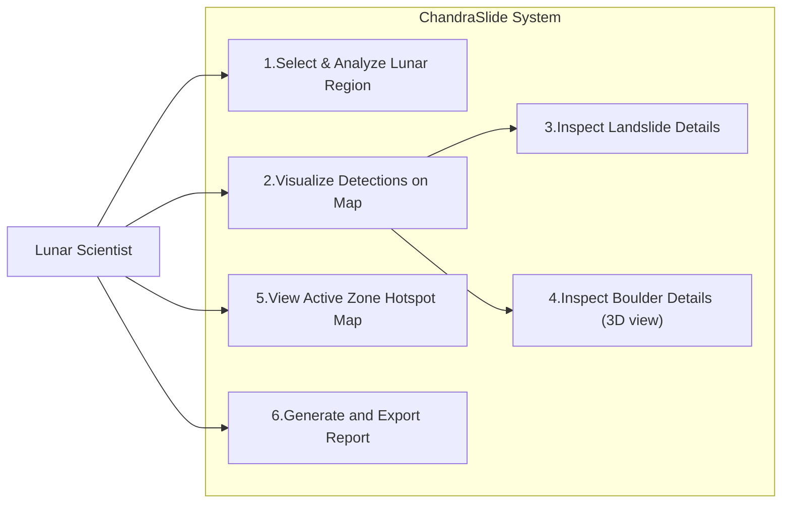

```mermaid
%%{init: {'theme': 'default'}}%%
flowchart LR
    A[Lunar Scientist]

    subgraph ChandraSlide_System [ChandraSlide System]
        UC1["1.Select & Analyze Lunar Region"]
        UC2["2.Visualize Detections on Map"]
        UC3["3.Inspect Landslide Details"]
        UC4["4.Inspect Boulder Details (3D view)"]
        UC5["5.View Active Zone Hotspot Map"]
        UC6["6.Generate and Export Report"]
    end

    A --> UC1
    A --> UC2
    A --> UC5
    A --> UC6

    UC2 --> UC3
    UC2 --> UC4
```
