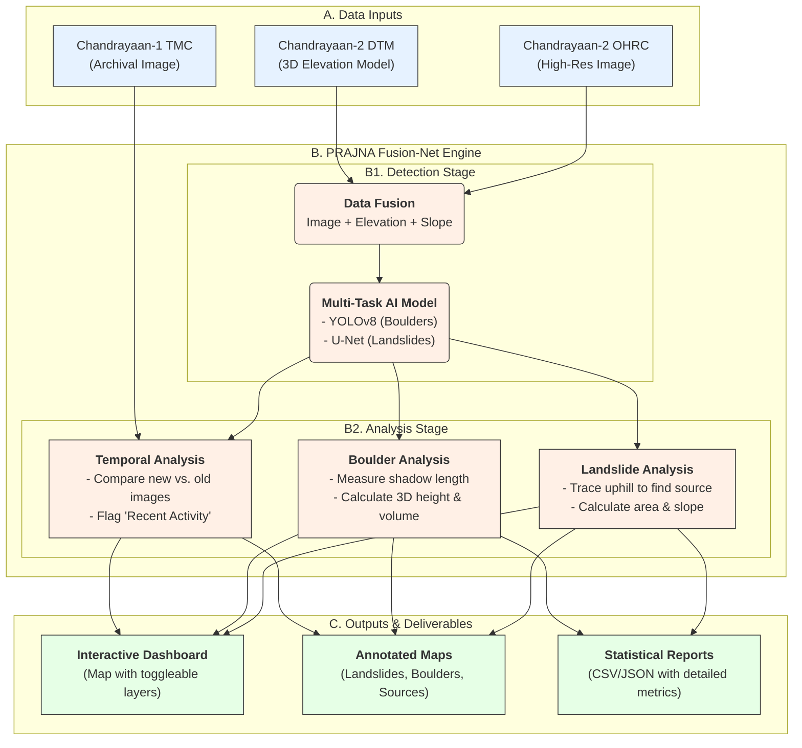

```mermaid
graph TD
    subgraph "A. Data Inputs"
        direction LR
        A1["Chandrayaan-2 OHRC<br/>(High-Res Image)"]
        A2["Chandrayaan-2 DTM<br/>(3D Elevation Model)"]
        A3["Chandrayaan-1 TMC<br/>(Archival Image)"]
    end

    subgraph "B. PRAJNA Fusion-Net Engine"
        subgraph "B1. Detection Stage"
            direction LR
            B1_IN("<b>Data Fusion</b><br/>Image + Elevation + Slope") --> B1_MODEL("<b>Multi-Task AI Model</b><br/>- YOLOv8 (Boulders)<br/>- U-Net (Landslides)")
        end
        
        subgraph "B2. Analysis Stage"
            B2_LS["<b>Landslide Analysis</b><br/>- Trace uphill to find source<br/>- Calculate area & slope"]
            B2_BD["<b>Boulder Analysis</b><br/>- Measure shadow length<br/>- Calculate 3D height & volume"]
            B2_TD["<b>Temporal Analysis</b><br/>- Compare new vs. old images<br/>- Flag 'Recent Activity'"]
        end
        B1_MODEL --> B2_LS
        B1_MODEL --> B2_BD
        B1_MODEL --> B2_TD
    end

    subgraph "C. Outputs & Deliverables"
        direction LR
        C1["<b>Interactive Dashboard</b><br/>(Map with toggleable layers)"]
        C2["<b>Annotated Maps</b><br/>(Landslides, Boulders, Sources)"]
        C3["<b>Statistical Reports</b><br/>(CSV/JSON with detailed metrics)"]
    end

    A1 --> B1_IN
    A2 --> B1_IN
    A3 --> B2_TD

    B2_LS --> C1
    B2_BD --> C1
    B2_TD --> C1
    
    B2_LS --> C2
    B2_BD --> C2
    B2_TD --> C2
    
    B2_LS --> C3
    B2_BD --> C3


    classDef inputs fill:#e6f2ff,stroke:#333
    classDef processing fill:#fff0e6,stroke:#333
    classDef outputs fill:#e6ffe6,stroke:#333
    
    class A1,A2,A3 inputs
    class B1_IN,B1_MODEL,B2_LS,B2_BD,B2_TD processing
    class C1,C2,C3 outputs
``` 